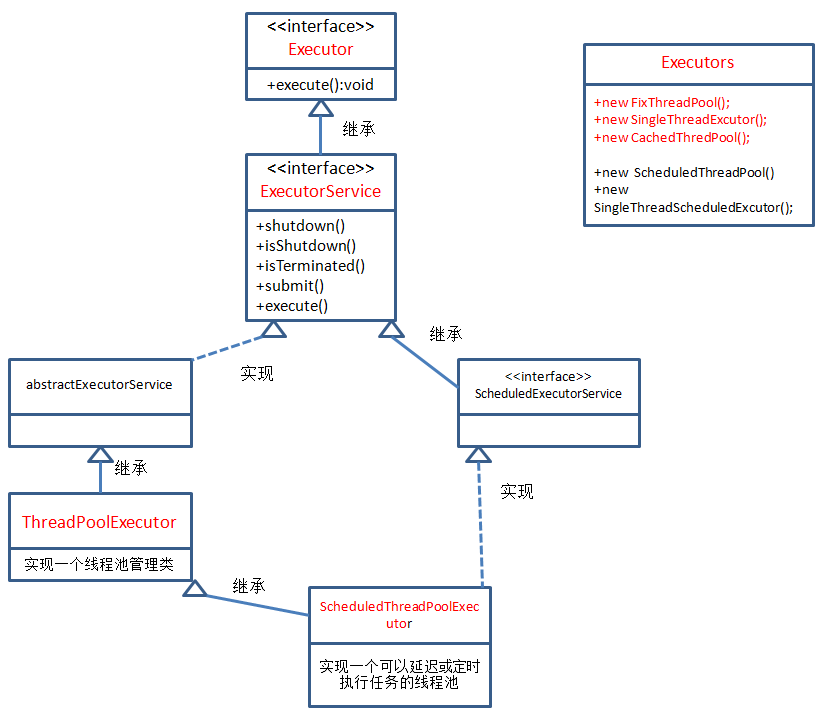

# 为什么使用线程池

## 构建新线程的缺点

- 每次创建新线程都又开销 
- 随意新建的线程，可以无限制创建，之间相互竞争，会导致过多占用系统资源导致系统瘫痪
- 随意新建的线程，不利于扩展，比如如定时执行、定期执行、线程中断

## 采用线程池的优点

- 重用线程，减少对象创建、消亡的开销
- 可有效控制最大并发线程数，提高系统资源的使用率，同时避免过多资源竞争，避免堵塞
- 提供定时执行、定期执行、单线程、并发数控制等功能

# Executor框架



## Executor

见[文件](res/Executor.java)

Executor接口是Executor框架中最基础的部分，定义了一个用于执行Runnable的execute方法，它没有实现类只有另一个重要的子接口ExecutorService。

## ExecutorService

见[文件](res/ExecutorService.java)

ExecutorService接口继承自Executor接口，定义了终止、提交、执行任务、跟踪任务返回结果等方法。

- execute(Runnable command)：履行Ruannable类型的任务
- shutdown()：不再接收新任务，在完成已提交的任务后关闭ExecutorService
- shutdownNow()：停止所有正在执行的任务并关闭ExecutorService
- isTerminated()：测试是否所有任务都执行完毕
- isShutdown()：测试是否该ExecutorService已被关闭
- submit(task)：提交Callable或Runnable任务，并返回代表此任务的Future对象
- invokeAll(tasks)：执行任务集合，并返回对应的Future对象集合
- invokeAny(tasks)：执行任务集合，并返回其中一个正确执行完毕任务的Future对象

## AbstractExecutorService

ExecutorService执行方法的默认抽象实现。

见[文件](res/AbstractExecutorService.java)

## ThreadPoolExecutor

线程池的实现类。

见[文件](res/ThreadPoolExecutor.java)

### 核心方法

```java
/**
     * Creates a new {@code ThreadPoolExecutor} with the given initial
     * parameters.
     *
     * @param corePoolSize the number of threads to keep in the pool, even
     *        if they are idle, unless {@code allowCoreThreadTimeOut} is set
     * @param maximumPoolSize the maximum number of threads to allow in the
     *        pool
     * @param keepAliveTime when the number of threads is greater than
     *        the core, this is the maximum time that excess idle threads
     *        will wait for new tasks before terminating.
     * @param unit the time unit for the {@code keepAliveTime} argument
     * @param workQueue the queue to use for holding tasks before they are
     *        executed.  This queue will hold only the {@code Runnable}
     *        tasks submitted by the {@code execute} method.
     * @param threadFactory the factory to use when the executor
     *        creates a new thread
     * @param handler the handler to use when execution is blocked
     *        because the thread bounds and queue capacities are reached
     * @throws IllegalArgumentException if one of the following holds:<br>
     *         {@code corePoolSize < 0}<br>
     *         {@code keepAliveTime < 0}<br>
     *         {@code maximumPoolSize <= 0}<br>
     *         {@code maximumPoolSize < corePoolSize}
     * @throws NullPointerException if {@code workQueue}
     *         or {@code threadFactory} or {@code handler} is null
     */
    public ThreadPoolExecutor(int corePoolSize,
                              int maximumPoolSize,
                              long keepAliveTime,
                              TimeUnit unit,
                              BlockingQueue<Runnable> workQueue,
                              ThreadFactory threadFactory,
                              RejectedExecutionHandler handler) 
```

- corePoolSize：核心线程数，如果运行的线程少于corePoolSize，则创建新线程来执行新任务，即使线程池中的其他线程是空闲的
- maximumPoolSize：最大线程数，可允许创建的线程数，线程池会根据corePoolSize和maximumPoolSize设置的边界自动调整大小
  - corePoolSize<maximumPoolSize：当workQueue满时才创建新线程
  - corePoolSize=maximumPoolSize：创建固定大小的线程池
- keepAliveTime：如果线程数多于corePoolSize，则这些多余线程的等待时间超过keepAliveTime时将被终止
- unit：keepAliveTime参数的时间单位
- workQueue：保存任务的阻塞队列，与线程池的大小有关
  - 当运行的线程数少于corePoolSize时，在有新任务时直接创建新线程来执行任务而无需再进队列
  - 当运行的线程数等于或多于corePoolSize，在有新任务添加时则选加入队列，不直接创建线程
  - 当队列满时，在有新任务时就创建新线程
- threadFactory：创建新线程的工厂，默认使用defaultThreadFactory创建线程
- handle：处理被拒绝任务的策略，默认使用ThreadPoolExecutor.AbortPolicy，任务被拒绝时将抛出RejectExecutorException

## ScheduledExecutorService

一个可定时调度任务的接口。

见[文件](res/ScheduledExecutorService.java)

## ScheduledThreadPoolExecutor

ScheduledExecutorService的实现，一个可定时调度任务的线程池。

见[文件](res/ScheduledThreadPoolExecutor.java)

# Executors工厂

提供了一系列静态工厂方法用于创建各种线程池。

见[文件](res/Executors.java)

提供的工厂方法都是基于ThreadPoolExecutor和ScheduledThreadPoolExecutor的构造函数，使用不同的参数组合实现。

# 扩展ThreadPoolExecutor

## 自定义ThreadFactory

## 自定义RejectedExecutionHandler

## 生命周期钩子

### beforeExecute

### afterExecute

