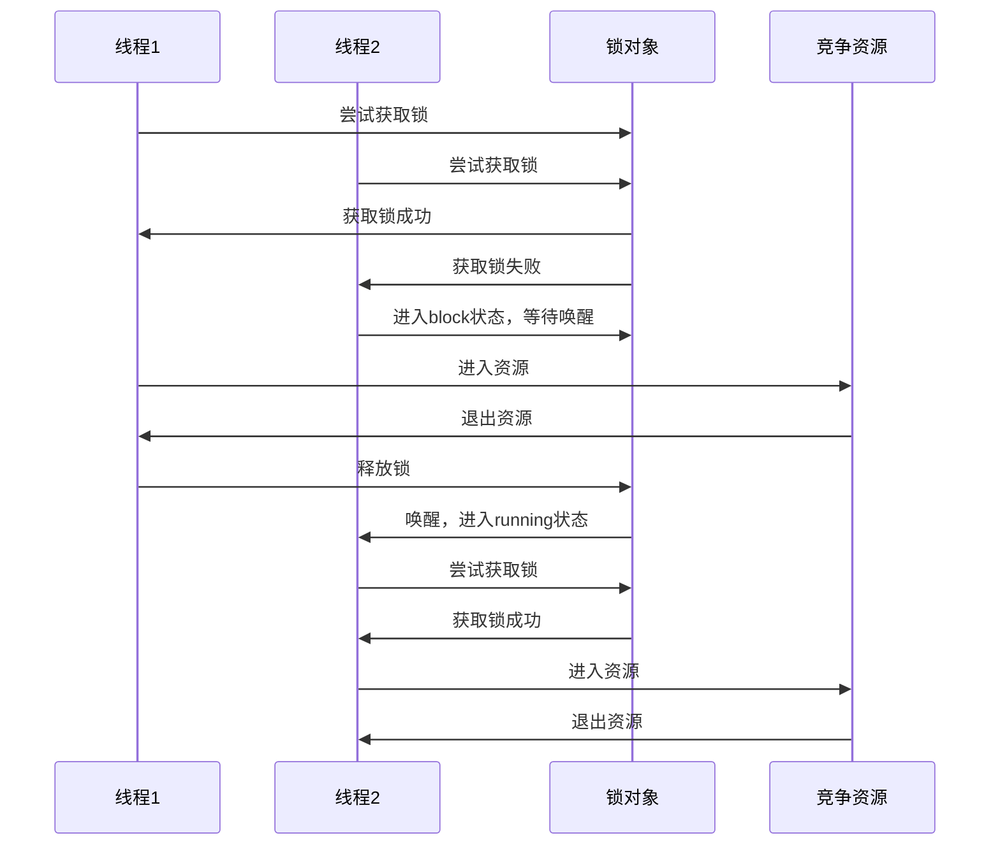
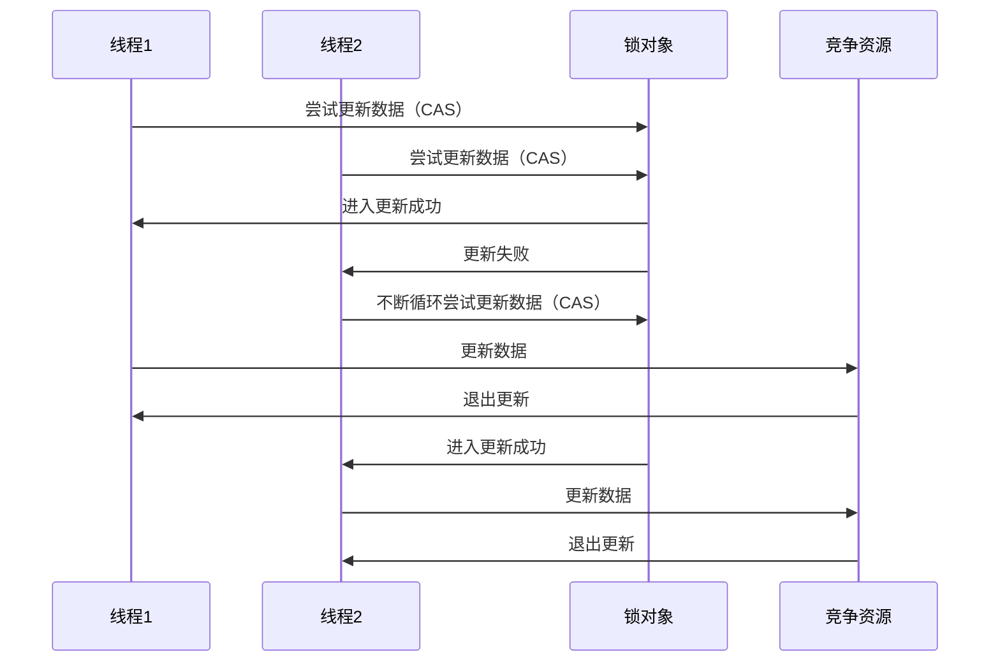
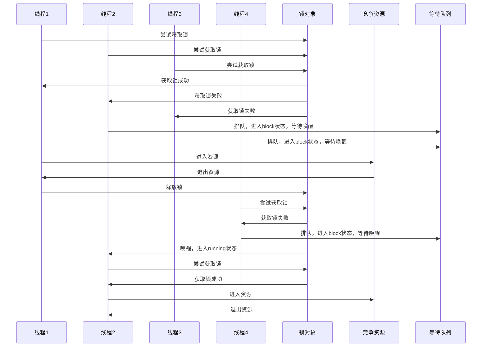
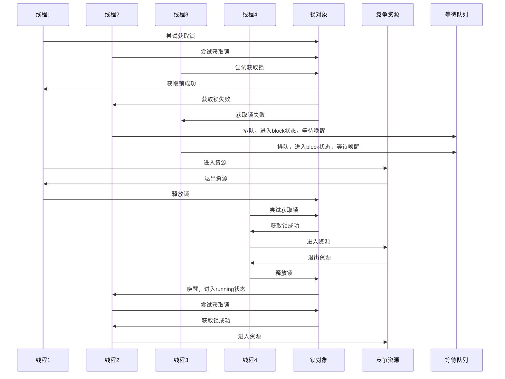

# 锁的几种分类方式

## 线程是否锁住同步资源

### 悲观锁

对于同一个数据的并发操作，悲观锁认为自己在使用数据的时候一定有别的线程来修改数据，因此在获取数据的时候会先加锁，确保数据不会被别的线程修改。Java中，synchronized关键字和Lock的实现类都是悲观锁。



### 乐观锁

对于同一个数据的并发操作，乐观锁认为自己在使用数据时不会有别的线程修改数据，所以不会添加锁，只是在更新数据的时候去判断之前有没有别的线程更新了这个数据。如果这个数据没有被更新，当前线程将自己修改的数据成功写入。如果数据已经被其他线程更新，则根据不同的实现方式执行不同的操作（例如报错或者自动重试）。

乐观锁在Java中是通过使用无锁编程来实现，最常采用的是CAS算法。



## 竞争锁失败，线程是否阻塞

### 同步锁

线程进入blocking状态，等待锁释放后的唤醒操作，重新进入running状态后再次竞争锁。

### 自旋锁

竞争资源失败的线程进行自旋，如果在自旋完成后前面锁定同步资源的线程已经释放了锁，那么当前线程就可以不必阻塞而是直接获取同步资源，从而避免切换线程的开销。这就是自旋锁。


### 适应性自旋锁

自旋锁本身是有缺点的，它不能代替阻塞。自旋等待虽然避免了线程切换的开销，但它要占用处理器时间。如果锁被占用的时间很短，自旋等待的效果就会非常好。反之，如果锁被占用的时间很长，那么自旋的线程只会白浪费处理器资源。所以，自旋等待的时间必须要有一定的限度，如果自旋超过了限定次数（默认是10次，可以使用-XX:PreBlockSpin来更改）没有成功获得锁，就应当挂起线程。
适应性自旋锁意味着自旋的时间（次数）不再固定，而是由前一次在同一个锁上的自旋时间及锁的拥有者的状态来决定。虚拟机会根据当前运行情况来判断可以自旋的时间，如果超时还没有竞争到资源，则直接阻塞线程，避免浪费处理器资源。

## 多个线程竞争锁时是否排队

### 公平锁

公平锁是指多个线程按照在锁释放时一定会重新竞争尝试获取锁，胜利者才能获得锁。CPU唤醒阻塞线程的开销比非公平锁大。

- 等待线程不会饿死
- 锁被释放后一定有线程切换的唤醒操作
- Synchronized锁是公平锁，但是不排队，乱序竞争



### 非公平锁

非公平锁是多个线程加锁时直接尝试获取锁，获取不到才会进入block状态等待唤醒。但如果此时锁刚好可用，那么这个线程可以无需阻塞直接获取到锁，所以非公平锁有可能出现后申请锁的线程先获取锁的场景。非公平锁的整体的吞吐效率高，因为线程有几率不阻塞直接获得锁，CPU不必唤醒所有线程。

- 等待线程可能饿死
- 锁被释放后有可能不用切换线程就可以马上被获取，减少了一次线程切换



## 多个线程是否可以共享锁

### 共享锁

共享锁也叫写锁，是指该锁可被多个线程所持有。如果线程T对数据A加上共享锁后，则其他线程只能对A再加共享锁，不能加排它锁。

### 独享锁

独享锁也叫排他锁、写锁，是指该锁一次只能被一个线程所持有。如果线程T对数据A加上排它锁后，则其他线程不能再对A加任何类型的锁。

## 线程是否可以重复获取同一个锁

### 可重入锁

可重入锁又名递归锁，是指在同一个线程在外层方法获取锁的时候，再进入该线程的内层方法会自动获取锁（前提锁对象得是同一个对象或者class），不会因为之前已经获取过还没释放而阻塞。

- ReentrantLock和synchronized都是可重入锁
- 可一定程度避免死锁

### 非可重入锁

非可重入锁，是指在同一个线程在外层方法获取锁的时候，再进入该线程的内层方法不会自动获取锁，必须等到前面获取的锁释放。

- 可能导致死锁

## 锁升级机制

### 无锁

资源没有被任何一个线程通过锁对象加锁，可以被任意线程通过乐观锁的方式修改。

### 偏向锁

锁对象总被一个线程获得，锁对象的Mark Word会记录访问线程的id，如果下次还是这个线程来尝试锁定，可以直接获得锁。

### 轻量级锁

当锁是偏向锁的时候，被另外的线程尝试获取锁，偏向锁就会升级为轻量级锁。其他线程会通过自旋的形式尝试获取锁，不会阻塞，从而提高性能。

### 重量级锁

当自旋超过一定的次数，或者一个线程在持有锁，一个在自旋，又有第三个来访时，轻量级锁升级为重量级锁。


```

```